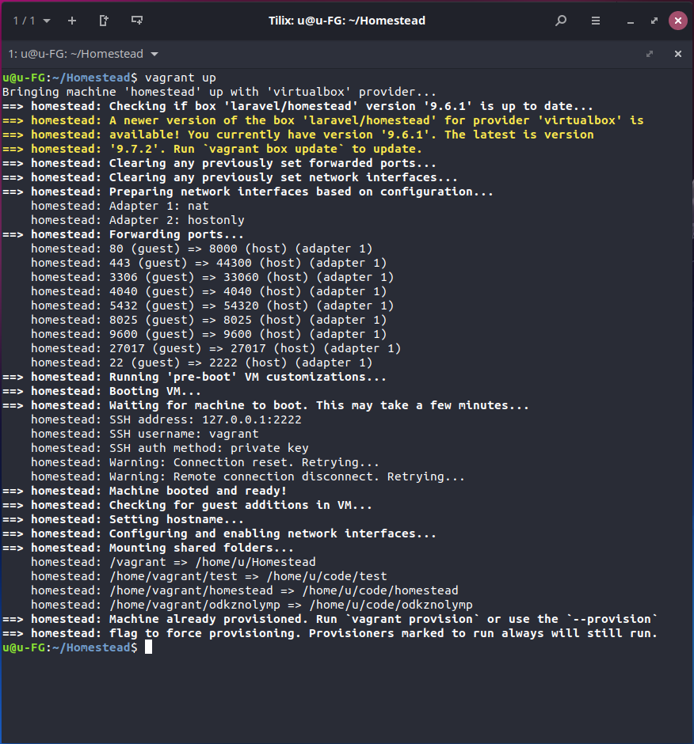

# Модуль 15
## Практическая работа

При выполнении данной работы использовалься <b><a href="https://laravel.com/docs/8.x/homestead">Laravel Homestead</a></b> — официальная подготовленная Vagrant-"коробка", которая предоставляет вам замечательную среду проектирования без обязательной установки PHP, HHVM, веб-сервера и любого другого программного серверного обеспечения на вашем компьютере.

#### Снимок экрана запуска виртуальной машины:

